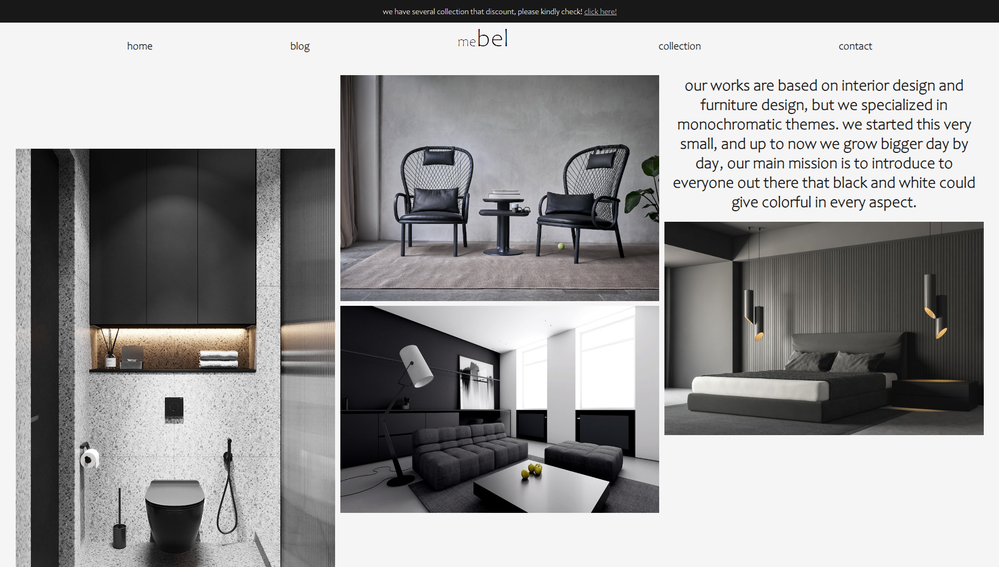

# my landing website - mebel

> my assignment for week 3 - landing website

this assignment needs us to make a responsive landing website, that includes several aspects, such as:

- using responsive design with a mobile-first approach
- using grid layout
- using flex layout
- including a dummy registration form

## mebel-landing website

this is a simple landing website made using HTML & CSS. thanks

## visit my website & other links

- Website: [rioyulinanda](https://w3-landing-website-rioyulinanda.netlify.app/)
- LinkedIn: [rioyulinanda](https://id.linkedin.com/in/rio-y-kurniawan-55293172)
- GitHub: [rioyulinanda](https://github.com/rioyulinanda)

## color references

- #181818 (nero)
- #F5F5F5 (whitesmoke)
- #FFFFFF (white)
- #FDF2E9 (linen)
